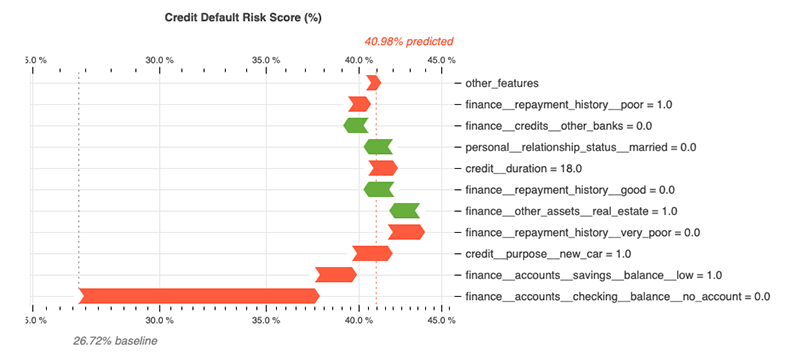
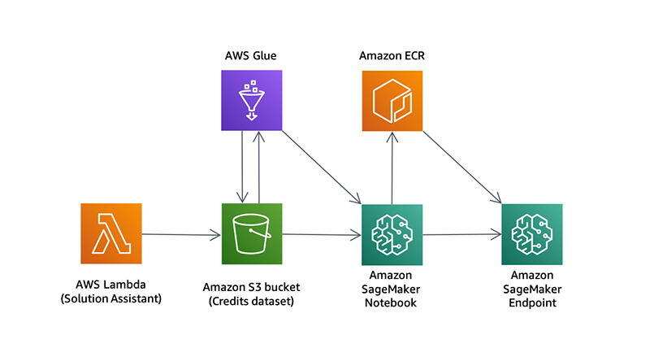

# Explaining Credit Decisions

Given the increasing complexity of machine learning models, the need for model explainability has been growing lately. Some governments have also introduced stricter regulations that mandate a *right to explanation* from machine learning models. In this solution, we take a look at how [Amazon SageMaker](https://aws.amazon.com/sagemaker/) can be used to explain individual predictions from machine learning models.

As an example application, we classify credit applications and predict whether the credit would be payed back or not (often called a *credit default*). More context can be found [here](#why-is-credit-default-prediction-useful-and-how-does-explainability-help). We train a tree-based [LightGBM](https://lightgbm.readthedocs.io/en/latest/) model using [Amazon SageMaker](https://aws.amazon.com/sagemaker/) and explain its predictions using a game theoretic approach called [SHAP](https://github.com/slundberg/shap) (SHapley Additive exPlanations). We deploy a endpoint that returns the credit default risk score, alongside an explanation.

**What is an explanation?**

Given a set of input features used to describe a credit application (e.g. 'credit_amount' and 'employment_duration'), an explanation reflects the contribution of each feature to the model's final prediction. We include a number of visualizations that can be used to see how each feature pushes up or down the risk of credit default for an individual application.

## Getting Started

You will need:

1. an AWS account. Sign up for an account [here](https://aws.amazon.com/).
2. permission to use [AWS CloudFormation](https://aws.amazon.com/cloudformation/) and to create all the resources detailed in the [architecture section](#architecture).
4. an AWS CloudFormation template. Copy this link or download [this file]((deployment/root-template.yaml)).

**Caution**: Cloning this GitHub repository and running the code manually could lead to unexpected issues! Use the AWS CloudFormation template. You'll get an Amazon SageMaker Notebook instance that's been correctly setup and configured to access the other resources in the solution.

Watch the following YouTube video for a detailed walk-through on how to get started:

## Contents

* `dataset/`
  * `german.data`: Original [German Credit Dataset](http://archive.ics.uci.edu/ml/datasets/statlog%2B%28german%2Bcredit%2Bdata%29) used to create synthetic datasets.
* `development/`
  * `explaining-credit-decisions.yaml`: Creates AWS CloudFormation Stack for solution.
  * `glue.yaml`: Used to create AWS Glue components.
  * `sagemaker.yaml`: Used to create Amazon SageMaker components.
  * `solution-assistant.yaml`: Used to prepare demonstration datasets and clean up resources.
* `source/`
  * `glue/`
    * `etl_job.py`: Use by AWS Glue Job to transform datasets.
  * `lambda/`
    * `datasets.py`: Used to generate synthetic datasets.
    * `lambda_function.py`: Solution Assistant create and delete logic.
    * `requirements.txt`: Describes Python package requirements of the AWS Lambda function.
  * `sagemaker/`
    * `notebook.ipynb`: Orchestrates the solution.
    * `requirements.txt`: Describes Python package requirements of the Amazon SageMaker Notebook instance.
    * `setup.py`: Describes Python package used in the solution.
    * `containers/`
      * `Dockerfile`: Describes custom Docker image hosted on Amazon ECR.
      * `requirements.txt`: Describes Python package requirements of the Docker image.
    * `src/`
      * `entry_point.py`: Used by Amazon SageMaker for training and endpoints hosting.
      * `entry_point_explanations.py`: Wraps the entry point above and adds a layer of explainability.
      * `package/`
        * `config.py`: Stores and retrieves project configuration. Optionally uses [dotenv](https://pypi.org/project/python-dotenv/).
        * `containers.py`: Manages the Docker workflow of building and pushing images to Amazon ECR.
        * `datasets.py`: Contains functions for reading datasets.
        * `glue.py`: Manages the AWS Glue workflow of crawling datasets and running jobs.
        * `preprocessing.py`: Scikit-learn steps to pre-process data for model.
        * `schemas.py`: Schema creation and data validation.
        * `training.py`: Scikit-learn steps to train and test model.
        * `utils.py`: Various utility functions for scripts and/or notebooks.
        * `visuals.py`: Contains explanation visualizations.

## Architecture

As part of the solution, the following services are used:

* [AWS Lambda](https://aws.amazon.com/lambda/): Used to generate a synthetic credits dataset and upload to Amazon S3.
* [AWS Glue](https://aws.amazon.com/glue/): Used to crawl datasets, and transform the credits dataset using Apache Spark.
* [Amazon S3](https://aws.amazon.com/s3/): Used to store datasets and the outputs of the AWS Glue Job.
* [Amazon SageMaker Notebook](https://aws.amazon.com/sagemaker/): Used to train the LightGBM model.
* [Amazon ECR](https://aws.amazon.com/ecr/): Used to store the custom Scikit-learn + LightGBM training environment.
* [Amazon SageMaker Endpoint](https://aws.amazon.com/sagemaker/): Used to deploy the trained model and SHAP explainer.

## Costs

You are responsible for the cost of the AWS services used while running this solution.

As of 6th April 2020 in the US West (Oregon) region, the cost to:

* prepare the dataset with AWS Glue is ~$0.75.
* train the model using Amazon SageMaker training job on ml.c5.xlarge is ~$0.02.
* host the model using Amazon SageMaker Endpoint on ml.c5.xlarge is $0.119 per hour.
* run an Amazon SageMaker notebook instance is $0.0582 per hour.

All prices are subject to change. See the pricing webpage for each AWS service you will be using in this solution.

## Cleaning Up

When you've finished with this solution, make sure that you have cleaned up any unwanted AWS resources. Most of this process can be automated with AWS CloudFormation, but there are a number of resources get created in the notebook that need to be cleaned up first.

Watch the following YouTube video for a detailed walk-through on to clean up resources.

## FAQ

### What is explainability?

Model explainability is the degree to which humans can understand the cause of decisions made by a machine learning model. Many methods now exist for formulating explanations from complex models that are interpretable and faithful.

### Why is explainability useful?

An explanation gives stakeholders a way to understand the relationships and patterns learned by a machine learning model. As an example, an explanation can be used to verify that meaningful relationships are being used by the model instead of spurious relationships. Such checks can give stakeholders more confidence in the reliability and robustness of the model for real-world deployments. It’s critical for building trust in the system. When issues are found, explanations often give scientists a strong indication of what needs to be fixed in the dataset or model training procedure: saving significant time and money. Other serious issues, such a social discrimination and bias, can be clearly flagged by an explanation.

### Why is credit default prediction useful? And how does explainability help?

Given a credit application from a bank customer, the aim of the bank is to predict whether or not the customer will pay back the credit in accordance with their repayment plan. When a customer can't pay back their credit, often called a 'default', the bank loses money and the customers credit score will be impacted. On the other hand, denying trustworthy customers credit also has a set of negative impacts.

Using accurate machine learning models to classify the risk of a credit application can help find a good balance between these two scenarios, but this provides no comfort to those customers who have been denied credit. Using explanability methods, it's possible to determine actionable factors that had a negative impact on the application. Customers can then take action to increase their chance of obtaining credit in subsequent applications.

### What is SHAP?

[SHAP](https://github.com/slundberg/shap) (Lundberg et al. 2017) stands for SHapley Additive exPlanations. 'Shapley' relates to a game theoretic concept called [Shapley values](https://en.wikipedia.org/wiki/Shapley_value) that is used to create the explanations. A Shapley value describes the marginal contribution of each 'player' when considering all possible 'coalitions'. Using this in a machine learning context, a Shapley value  describes the marginal contribution of each feature when considering all possible sets of features. 'Additive' relates to the fact that these Shapley values can be summed together to give the final model prediction.

As an example, we might start off with a baseline credit default risk of 10%. Given a set of features, we can calculate the Shapley value for each feature. Summing together all the Shapley values, we might obtain a cumulative value of +30%. Given the same set of features, we therefore expect our model to return a credit default risk of 40% (i.e. 10% + 30%).

## Useful Resources

* [Amazon SageMaker Developer Guide](https://docs.aws.amazon.com/sagemaker/latest/dg/whatis.html)
* [Amazon SageMaker Python SDK Documentation](https://sagemaker.readthedocs.io/en/stable/)
* [AWS CloudFormation User Guide](https://docs.aws.amazon.com/AWSCloudFormation/latest/UserGuide/Welcome.html)
* [AWS Glue Developer Guide](https://docs.aws.amazon.com/glue/latest/dg/getting-started.html)

## Credits

Our datasets (i.e. credits, people and contacts) were synthetically created from features contained in the [German Credit Dataset](http://archive.ics.uci.edu/ml/datasets/statlog%2B%28german%2Bcredit%2Bdata%29) (UCI Machine Learning Repository). All personal information was generated using [`Faker`](https://faker.readthedocs.io/en/master/).

## License

This project is licensed under the Apache-2.0 License.